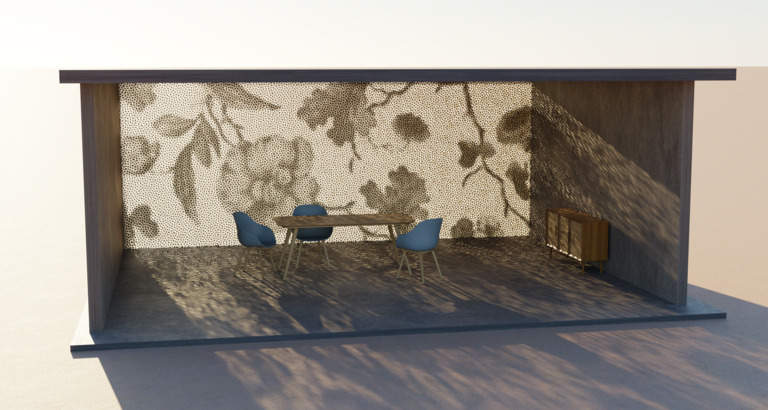
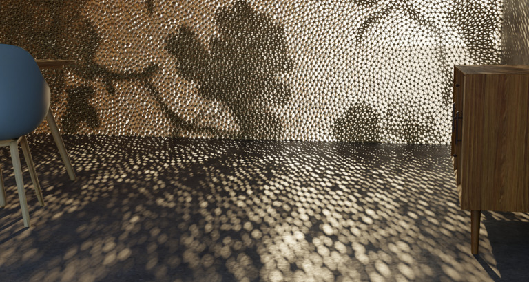

# Mechanical Cloaking of Halftoned Imagery

[](https://www.gnu.org/licenses/agpl-3.0)

Implementation to replicate the results and figures presented in the paper:

> **[Mechanical Cloaking of Halftoned Imagery](https://hal.science/hal-05669445v1/file/main.pdf)**
> J. Martínez, S. Brisard, K. Danas, E. Garner, S. Kumar, S. Lefebvre
> *ACM Transactions on Graphics (Proc. SIGGRAPH), 45(4), 2026*

<p align="center">
  <a href="https://youtu.be/vjE0_ofYhMw?si=jsrxItWJDxzm7Kqb" target="_blank">
    
  </a>
  <a href="https://youtu.be/vjE0_ofYhMw?si=jsrxItWJDxzm7Kqb" target="_blank">
    
  </a>
</p>

---

## Repository structure

* `code/` — Contains all source code.
* `results/` — Output directory where generated data and figures will be populated.

---

## 🛠Prerequisites

### Supported platforms
* Tested on **Linux** and **macOS**.

### Dependencies
Ensure you have the following installed on your host system:
* **CMake**
* **C++ Compiler**
* **Anaconda** or **Miniconda**

---

## ⚙Configuration
```
git submodule update --init --recursive
cd code
conda env create --file environment.yml
conda activate isodither
source build_external.sh
```

If available, installing [PyPardiso](https://github.com/haasad/PyPardiso) will significantly accelerate the finite element analysis:
```
conda install -c conda-forge pypardiso
```
---

## Results and figures


### Option A: quick replication
Some routines (such as homogenization and FEM) can take a significant amount of compute time and memory. To only run a subset of results and replicate some figures in a reasonable amount of time execute:

```
./some_results_plots.sh
./convert_pgf.sh
```
This will generate the following PDF figures in results/isodither/:
* overview_geometry.pdf → Figure 2
* retraction.pdf → Figure 3
* retraction_gallery.pdf → Figure 4
* mean_fluctuations.pdf → Figure 5

### Option B: full replication
To completely recalculate all results from scratch, execute:

```
./all_results.sh
./all_plots.sh 
./convert_pgf.sh
```

All generated plots will be output as PDFs in the results/isodither/ subfolder.